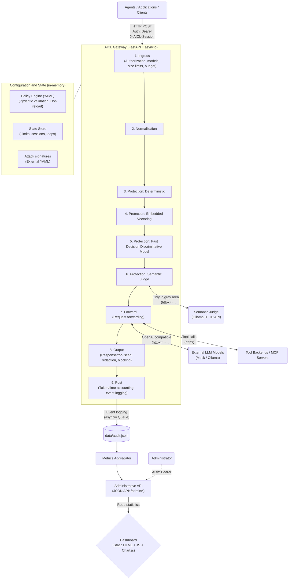

# JMK AI Security Layer (AICL)

AICL is a security gateway that sits between AI agents or applications and the things they call: language models, tools and MCP servers. Every request and every response passes through a pipeline of controls defined in one YAML policy. The gateway can allow, redact, flag, block or hold a request for operator approval, enforces token, cost and compute budgets, and writes an audit log that feeds a built-in dashboard.

Built for the HackYeah 2026 challenge "AI Control Layer".

## Contents

- [What it does](#what-it-does)
- [Architecture](#architecture)
- [Controls and threats](#controls-and-threats)
- [Integration points](#integration-points)
- [Policy](#policy)
- [Testing](#testing)
- [Measured results](#measured-results)
- [Running](#running)
- [Dashboard and reporting](#dashboard-and-reporting)
- [Known limitations](#known-limitations)
- [Repository layout](#repository-layout)
- [Further documentation](#further-documentation)

## What it does

- **Hybrid detection.** Deterministic checks run on every request: Unicode normalization, bounded decoding of base64, hex, URL, rot13, leetspeak and spaced-out text, regular expressions, a signature feed, PII and secret detectors with checksum validation. Three AI tiers handle what patterns miss: multilingual embedding similarity (`bge-m3` through Ollama), an in-process prompt-injection classifier (ProtectAI DeBERTa-v3, ONNX Runtime, Apache-2.0) and a local LLM judge (Qwen 2.5 through Ollama) that is only consulted for untrusted content and for requests in the risk grey zone.
- **Agent-specific controls.** Tool allowlists per role with JSON-schema argument validation and SSRF checks, session taint tracking (after untrusted data enters a session, high-privilege tools are blocked or need approval), runaway-loop detection, memory/RAG namespace access control, delegation limits based on the policy and on a depth tracked by the gateway.
- **Full traffic coverage.** Message content, message names, earlier tool-call arguments, tool definitions sent to the model (tool poisoning), text hidden in `data:` URLs, model refusals and reasoning fields, model-proposed tool calls and every field of a tool result are inspected.
- **Budgets.** Tokens, cost, compute seconds and requests per minute per identity. The expected usage is reserved before the upstream call, so concurrent requests cannot overshoot a limit; a refusal returns HTTP 429 with `Retry-After`. Commercial models are priced per token, local models are limited by compute time.
- **Historical attacks.** A signature feed (local file or a remote URL with ETag and HMAC verification) drives the injection, supply-chain and artifact checks. Model files and pickles are analysed statically with `pickletools` and are never loaded.
- **Live configuration.** The policy and the feeds are hot-reloaded within about one second. An invalid file is rejected and the previous version stays active; the rejection is recorded in the audit log.
- **Human approval.** A control can require an operator decision. The approval is bound to the identity and to the exact action, can be used once and expires.
- **Shared state.** Budgets, sessions and approvals live in memory by default or in Redis (`AICL_STATE_URL`), so several gateway instances can run behind a load balancer.

## Architecture



A request stops at the first blocking decision (`evaluation: first_block`) or collects every decision (`collect_all`). Redactions are applied by the engine using the character spans returned by the controls; a match that has no span (found only in decoded text) is escalated to a block. The upstream model is always called without streaming so that output can be checked; if the client asked for `stream=true`, the checked response is re-emitted as server-sent events.

A detailed design, including the data contracts, is in [ARCHITECTURE.md](ARCHITECTURE.md).

## Controls and threats

21 controls cover 20 threats, mapped to OWASP Top 10 for LLM Applications (2025), OWASP Top 10 for Agentic Applications and MITRE ATLAS (`catalog/threats.yaml`).

| Threat | Description | Controls |
|---|---|---|
| TH-01 | Direct prompt injection | C-INJ-PAT, C-INJ-EMB, C-INJ-BASTION, C-INJ-SEM |
| TH-02 | Indirect prompt injection (tool output, documents, tool descriptions) | C-INJ-PAT, C-INJ-EMB, C-INJ-BASTION, C-INJ-SEM |
| TH-03 | PII in prompts | C-PII-IN |
| TH-04 | Secrets and credentials | C-SECRET-IN, C-SECRET-OUT |
| TH-05 | PII in responses and tool results | C-PII-OUT |
| TH-06 | Disallowed model | C-MODEL-ALLOW |
| TH-07 | Excessive agency, tool misuse | C-TOOL-ACL |
| TH-08 | Missing authentication, impersonation | C-AUTH |
| TH-09 | Delegation and privilege escalation | C-DELEG |
| TH-10 | Unauthorized memory/RAG access | C-MEM-ACL |
| TH-11 | Token overuse | C-BUDGET |
| TH-12 | Cost and compute overuse | C-BUDGET |
| TH-13 | Runaway tool loops | C-LOOP |
| TH-14 | Unsafe deserialization | C-ARTIFACT |
| TH-15 | Malicious code execution | C-CODE-EXEC |
| TH-16 | Supply-chain compromise | C-SUPPLY |
| TH-17 | Known attack signatures | C-SIG |
| TH-18 | System prompt and canary leakage | C-CANARY |
| TH-19 | Privileged action in a tainted session | C-TAINT |
| TH-20 | Oversized payloads | C-SIZE |

## Integration points

| Endpoint | Use |
|---|---|
| `POST /v1/chat/completions` | OpenAI-compatible chat proxy. Point an existing client at the gateway and use an AICL key. |
| `POST /v1/tools/invoke` | Tool execution: `{"tool", "arguments", "session_id"}`. The gateway checks the call, forwards it to the backend from the policy and scans the result. |
| `POST /mcp/<server>` | MCP proxy (Streamable HTTP, JSON-RPC 2.0, protocol 2025-06-18). Change the MCP server URL in the agent and add the AICL key. |
| `POST /v1/artifacts/scan` | Static scan of a model file or archive. |
| `GET /dashboard/` | Operator dashboard. |
| `/admin/*` | Policy, metrics, events, audit export, approvals, self-test. Admin key required. |

Requests carry `Authorization: Bearer <key>` and optionally `X-AICL-Session`. Session ids are bound to the authenticated identity, so one identity cannot read or taint another identity's session. Responses carry `X-AICL-Request-Id`, `X-AICL-Action`, `X-AICL-Policy-Version` and `X-AICL-Overhead-Ms`.

### MCP proxy

The gateway acts as an MCP server towards the agent and as an MCP client towards the real server.

| Method | Behaviour |
|---|---|
| `initialize` | Answered by the gateway; issues `Mcp-Session-Id` (an AICL session bound to the identity). |
| `tools/list` | Only tools declared in the policy as `<server>.<tool>` and permitted for the caller's role are listed. Tool descriptions are scanned; a tool with a poisoned description is hidden. |
| `tools/call` | Same pipeline as `/v1/tools/invoke`. A block, an approval request or a budget stop is returned as a tool result with `isError: true` and the reason, so the agent's model can react. |
| other methods | `resources/*`, `prompts/*` and the rest return `-32601`: only tools are proxied. |

Configuration in the policy:

```yaml
mcp_servers:
  docs: {url_env: AICL_MCP_DOCS_URL}     # optional bearer_token_env for the upstream server
tools:
  docs.search:    {mcp_server: docs, privilege: low,  output_trust: untrusted}
  docs.send_mail: {mcp_server: docs, privilege: high, output_trust: trusted}
```

Compatibility was checked with the official MCP Python SDK client. MCP tools can also be called through `/v1/tools/invoke` with the tool name `docs.search`.

### Human approval

A control with `action: require_approval` (or `taint.action: require_approval`) answers HTTP 403 `aicl_approval_required` with an `approval_id`. An operator approves or rejects it in the dashboard (Approvals) or through `POST /admin/approvals/<id>/approve|reject`. The client retries the same call with `X-AICL-Approval-Id`; a different action or a second use is refused.

### Policy preview

`POST /admin/policy/preview?last_n=50` replays recent audited requests against a candidate policy and returns the requests whose outcome would change. The dashboard exposes it on the Policy page.

## Policy

One file, [policies/default.yaml](policies/default.yaml), configures identities and roles, models and prices, tools, MCP servers, budgets, the controls and their actions per profile, the semantic judge, taint, memory namespaces, signature feeds and the audit log.

- Three profiles: `strict`, `balanced`, `permissive`. Each control defines its action per profile (`block`, `redact`, `flag`, `require_approval`, `allow`) and its thresholds. An identity can be pinned to a profile.
- `mode: shadow` (global or per control) records what a control would have done without enforcing it.
- `on_error: fail_open | fail_closed` per control.
- Unknown keys and unknown control ids are rejected at load and at hot reload.

[policies/hybrid.yaml](policies/hybrid.yaml) is generated from the default policy by `scripts/make_hybrid_policy.py` and switches on the embedding tier, the classifier and the judge. The default policy keeps them off so that the test suite runs without models or network.

## Testing

There are three ways to test, for three different questions.

| Mode | What it checks | How |
|---|---|---|
| Test suite | The code against the reference policy: positive, negative and edge cases for every control, budgets, artifacts, MCP, the agent loop | `make test` or `docker compose run --rm tests` |
| Live self-test | The running gateway with the policy loaded right now. Each probe's expected outcome is computed from the current configuration (the control's action for the profile, shadow mode, disabled controls). | Dashboard, Tests, "Run self-test"; or `make selftest` (`python scripts/selftest.py --url ...`, exit code 1 on a failure) |
| Playground | Ad-hoc prompts. Presets marked `[Self-test]` show the expected outcome under the current policy and a PASS or FAIL verdict. | Dashboard, Playground |

The test suite deliberately compares against the reference policy: if someone weakens `policies/default.yaml`, the cases of the affected control fail and name it. To check a changed configuration, use the self-test: edit the policy, wait about one second for the reload and run it again. The report says which control acted, including defence in depth (for example "C-INJ-PAT off; still stopped by C-SIG").

Other test tools:

```bash
make test-live JUDGE_MODEL=qwen2.5:3b   # tests that need a real Ollama
make fuzz                               # mutation fuzzer, bypass rate per strategy
make agent                              # a real tool-using agent through the gateway
python scripts/stack_test.py            # held-out prompt-injection set against a running gateway with AI tiers
```

The test cases in `tests/cases/*.yaml` are data: a case lists the requests and the expected status, action, controls, threats and whether the upstream was called. A judge can add a case without writing code.

### Agent demo

`scripts/agent_demo.py` is a function-calling agent: a local model (the policy's `ollama-local`, Qwen 2.5) decides which tools to call, and every model call and tool call goes through the gateway.

| Scenario | What happens |
|---|---|
| `benign` | The model searches the documentation and answers. |
| `taint` | After reading untrusted documentation the model tries to send an e-mail; C-TAINT stops the high-privilege call. |
| `indirect` | The model fetches a web page with a hidden instruction; the tool result is blocked. |

## Measured results

Measured on a laptop CPU (no GPU). Reports are written to `reports/`.

| Measurement | Result | Source |
|---|---|---|
| Test suite | 829 passed, 7 skipped (live tests needing Ollama or Redis) | `make test` |
| Data-driven cases | 234/234; every control has at least 3 negative, 3 positive and 2 edge cases | `reports/test_report.md` |
| Gateway overhead, deterministic path, 2 KB prompt | p50 9.8 ms, p95 14.4 ms | `reports/perf.json` |
| Fuzzer | 0 bypasses out of 26 variants across 14 mutation strategies | `reports/fuzz_*.json` |
| Held-out injection set, all tiers on (balanced profile, judge `qwen2.5:3b`) | 46/47 attacks detected, 0/29 false positives, 17 languages | `reports/stack_test.md` |
| Live self-test, reference policy | 20/20 probes pass | `make selftest` |

> [!IMPORTANT]
> **NOTE REGARDING SEMANTIC JUDGE MODEL AND RUNTIME ENVIRONMENT:**
> Due to hackathon evaluation time constraints and model weight download sizes (~several GBs), the full local LLM used as semantic judge (`qwen2.5` / `llama3.2`) **cannot download in time during standard live evaluation startup**.
> Therefore, in the default Docker container (`docker compose up`), the semantic tier uses the built-in fast mock/heuristic engine, while full model pulling and execution with real Ollama is isolated in the `hybrid` profile (`docker compose --profile hybrid up`).
> **The targeted, full live operation with real weights and Ollama is demonstrated in detail in the submitted video presentation!**
> 
> *All tests and runs are executed strictly via the Docker environment.*

## Running

### Docker Compose

```bash
docker compose up                       # gateway :8080, mock LLM :9001, mock tools :9002, mock MCP server :9003
docker compose run --rm tests           # full test suite in a container
docker compose --profile hybrid up      # adds Ollama (models pulled on first start, about 4 GB) and a gateway with the AI tiers on :8081
AICL_EXTRAS=test,redis docker compose build
AICL_STATE_URL_OVERRIDE=redis://redis:6379/0 docker compose --profile redis up   # shared state in Redis
```

The gateway container runs as a non-root user; ports are bound to 127.0.0.1. The audit log is kept in a named volume; export it with `GET /admin/export/audit.jsonl`.
The dashboard is at `http://localhost:8080/dashboard/`. The development admin key is `dev-key-admin` (a warning is logged and audited while `dev-key-*` keys are in use).

The step-by-step guide is [manual.md](manual.md).

## Dashboard and reporting

The dashboard is a static page served by the gateway (vanilla JavaScript, Chart.js vendored, no CDN). It reads only `/healthz` and `/admin/*`.

- **Overview**: requests by final action over time, block rate, cost, gateway overhead, active controls.
- **Threats**: detections by threat, severity and endpoint.
- **Controls**: every control with its mode, stages, actions per profile and test coverage.
- **Budgets**: usage against limits per identity.
- **Performance**: p50/p95/p99 overhead in total and per control, share of requests that reached the LLM judge.
- **Audit events**: live feed (server-sent events), filters, event details, JSONL export.
- **Approvals**: the human-approval queue.
- **Policy**: active policy, validation and impact preview of a candidate policy.
- **Tests**: live self-test, results of the last test-suite run, coverage heatmap, fuzzer bypass rates.
- **Playground**: send prompts as any identity and see the decision, redactions, latency and the audit record.

Audit events are JSON lines with masked excerpts only; raw secrets and PII are never written. The log rotates by size (`audit.max_file_bytes`, `audit.keep_files`).

## Known limitations

- The LLM judge runs on CPU: several seconds per judged request. On prompts that contain credentials, the small judge (`qwen2.5:3b`) sometimes treats the credential itself as an attack and blocks instead of letting C-SECRET-IN redact it.
- With the plain `docker compose up` stack the judge talks to the mock LLM, so the semantic tier is effectively off; the `hybrid` profile runs the real models.
- The MCP proxy supports the HTTP transport only (no stdio servers). Upstream MCP sessions are kept in the memory of each gateway instance and are re-created after a restart.
- The `mock-commercial` model stands in for a paid API; the policy has no setting for upstream API keys yet.

## Repository layout

```
aicl/
  app.py              application factory and routes
  engine.py           pipeline: runs the controls of a stage and merges decisions
  models.py           data contracts (segments, decisions, audit events)
  controls/           one file per control
  flows/              chat, tool invoke, MCP proxy, artifact scan
  policy/             schema, loader, policy preview
  semantic/           embedding index, classifier, LLM judge client
  proxy/              upstream LLM, tool and MCP clients
  state/              in-memory and Redis state stores
  admin/              /admin API: policy, telemetry, approvals, self-test
  selftest.py         live self-test probes and verdicts
  dashboard/          operator dashboard
policies/             default.yaml (reference) and hybrid.yaml (AI tiers on)
feeds/                attack signatures, injection example corpus
catalog/              threat catalog with OWASP and ATLAS references
scripts/              self-test, agent demo, cascade benchmark, feed server, demo traffic
tests/                test suite: YAML cases, harness, mocks, fuzzer
docker/, docker-compose.yml, Makefile
```

## Further documentation

- [manual.md](manual.md): how to install, run, test and demonstrate the project.
- [ARCHITECTURE.md](ARCHITECTURE.md): design, contracts, policy reference.
- [docs/SEMANTIC_SETUP.md](docs/SEMANTIC_SETUP.md): Ollama, embedding, classifier and judge setup and calibration.
- [aicl/dashboard/README.md](aicl/dashboard/README.md): dashboard data sources.
